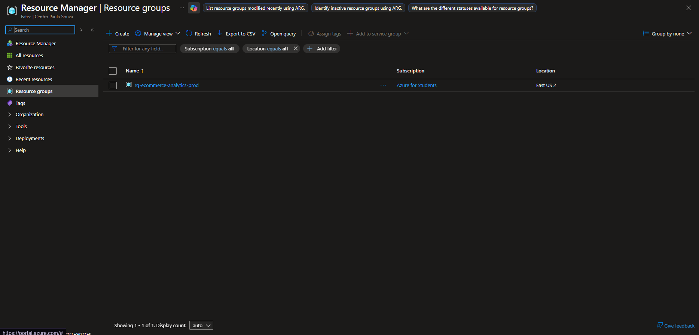
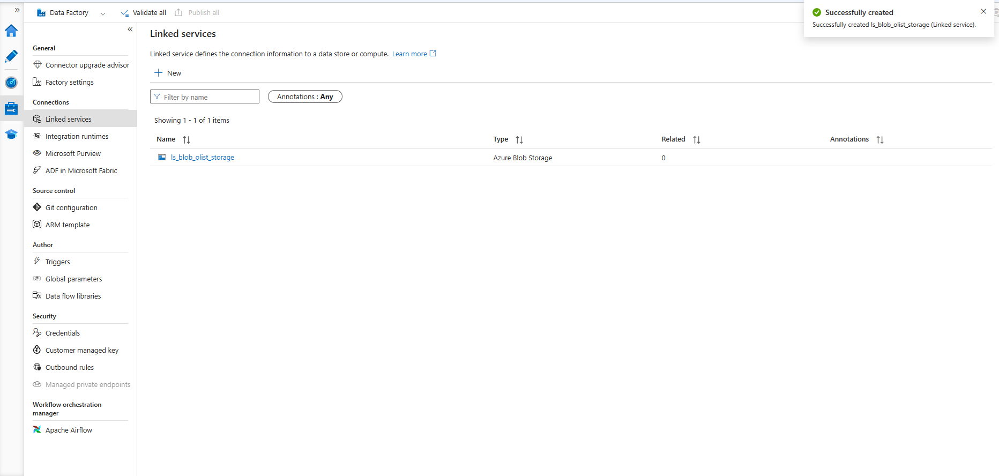
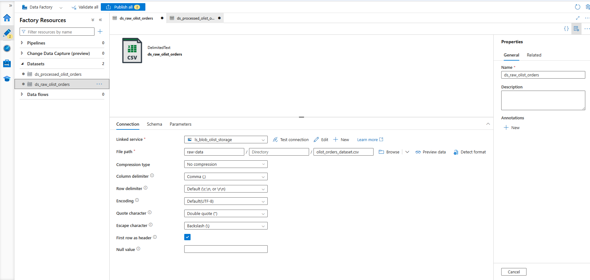
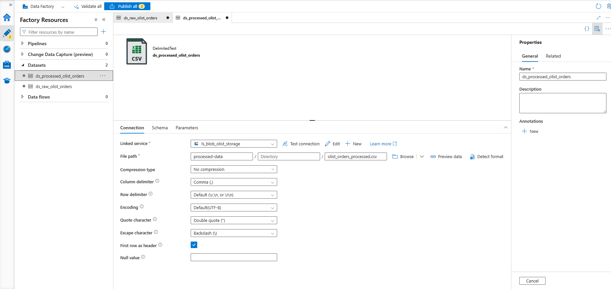
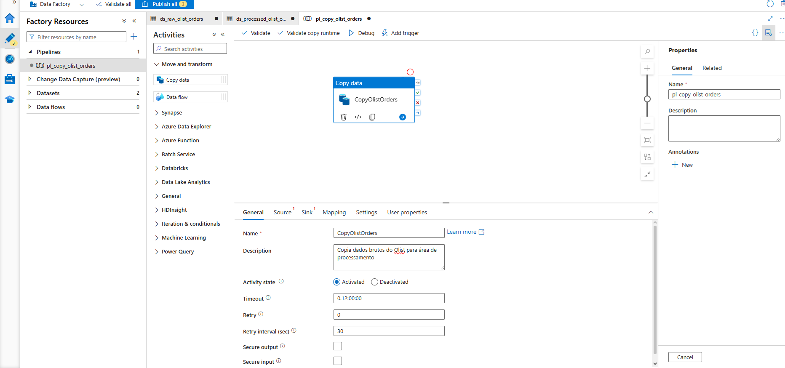
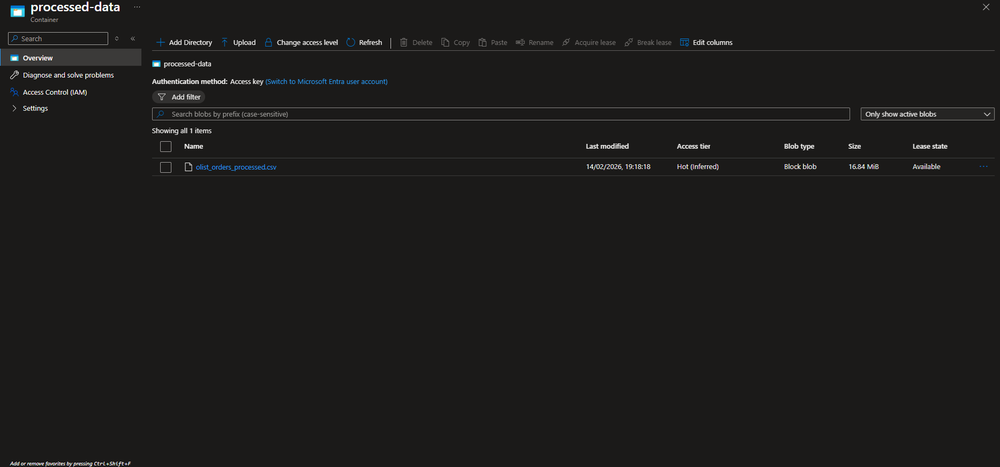

# Pipeline de Dados E-commerce com Azure Data Factory

Este projeto documenta a implementação de uma pipeline ETL (Extract, Transform, Load) na nuvem Azure, utilizando dados reais do e-commerce brasileiro Olist. O objetivo é demonstrar a aplicação prática dos conceitos de Cloud Computing, serviços PaaS e orquestração de dados.

## Contexto

Durante meu aprendizado sobre computação em nuvem, explorei conceitos como IaaS, PaaS, SaaS e os diferentes modelos de implantação (pública, privada e híbrida). Este projeto consolida esse conhecimento através de uma implementação prática no Microsoft Azure.

## Arquitetura do Projeto

A solução utiliza os seguintes recursos do Azure:

- **Resource Group**: Organização lógica de todos os recursos
- **Azure Storage Account**: Armazenamento de dados brutos e processados em containers Blob
- **Azure Data Factory**: Orquestração da pipeline de movimentação de dados

### Fluxo de Dados

[Dataset Olist] → [raw-data container] → [Data Factory Pipeline] → [processed-data container]

A pipeline realiza a cópia dos dados do container de origem (raw-data) para o container de destino (processed-data), simulando um processo de ingestão de dados que poderia ser expandido com transformações mais complexas.

## Recursos Criados

### Resource Group

- Nome: rg-ecommerce-analytics-prod
- Região: East US 2 (Só que usei Central Mexico no Storage Account e nos ADFs)
- Função: Agrupa todos os recursos do projeto para facilitar o gerenciamento

### Storage Account

- Nome: stolistsalesdata
- Tipo: Standard LRS (Locally Redundant Storage)
- Containers criados:
  - raw-data: Armazena dados originais
  - processed-data: Armazena dados processados pela pipeline

### Azure Data Factory

- Nome: adf-olist-sales-pipeline
- Versão: V2
- Função: Orquestração e automação do fluxo de dados

## Componentes da Pipeline

### Linked Service

Estabelece a conexão entre o Data Factory e o Storage Account.

- Nome: ls_blob_olist_storage
- Tipo: Azure Blob Storage
- Autenticação: Account Key

### Datasets

**Dataset de Origem (Source)**

- Nome: ds_raw_olist_orders
- Formato: CSV delimitado
- Localização: raw-data/olist_orders_dataset.csv
- First row as header: Habilitado

**Dataset de Destino (Sink)**

- Nome: ds_processed_olist_orders
- Formato: CSV delimitado
- Localização: processed-data/olist_orders_processed.csv
- First row as header: Habilitado

### Pipeline

- Nome: pl_copy_olist_orders
- Atividade: Copy Data
- Descrição: Copia dados brutos do Olist para área de processamento

## Execução e Resultados

A pipeline foi executada com sucesso, realizando a transferência de 99.441 registros de pedidos do e-commerce Olist.

### Validação

O arquivo processado foi criado corretamente no container de destino, confirmando o funcionamento da pipeline.

## Conceitos Aplicados

### Modelos de Nuvem

Este projeto utiliza **Nuvem Pública** (Azure), onde a infraestrutura é gerenciada pela Microsoft e compartilhada entre múltiplos clientes. A escolha se justifica pelo menor custo inicial e pela escalabilidade sob demanda.

### Classificação dos Serviços

- **Azure Storage Account**: PaaS - Plataforma gerenciada para armazenamento de dados
- **Azure Data Factory**: PaaS - Serviço gerenciado para orquestração de pipelines de dados

Ambos os serviços abstraem a complexidade de infraestrutura (servidores, rede, sistema operacional), permitindo foco no desenvolvimento da solução.

### Vantagens da Abordagem Cloud

Comparado com uma solução on-premise, este projeto se beneficia de:

- **Custo reduzido**: Sem necessidade de investimento em hardware
- **Escalabilidade**: Capacidade de processar volumes maiores de dados conforme necessário
- **Manutenção**: Atualizações e patches gerenciados pela Microsoft
- **Alta disponibilidade**: Redundância de dados através do LRS

### Nomenclatura e Boas Práticas

O projeto segue convenções de nomenclatura do Azure:

- Prefixos descritivos (rg-, adf-, st-, ds-, ls-, pl-)
- Nomes em lowercase para storage accounts
- Descrições claras da finalidade de cada recurso
- Organização por ambiente (prod)

## Aprendizados

Durante a implementação deste projeto, consolidei conhecimentos sobre:

1. **Organização de recursos na nuvem**: A importância do Resource Group para gestão centralizada
2. **Serviços PaaS**: Como abstraem a complexidade de infraestrutura
3. **Pipelines de dados**: Conceitos de ETL aplicados na prática
4. **Boas práticas**: Nomenclatura padronizada e separação de ambientes (raw/processed)

## Possíveis Evoluções

Este projeto pode ser expandido com:

- Implementação de triggers para execução automática
- Adição de atividades de transformação de dados
- Integração com Azure Synapse Analytics ou Power BI para visualização
- Implementação de tratamento de erros e logs
- Uso de parâmetros dinâmicos na pipeline
- Processamento de múltiplos arquivos do dataset Olist

## Dataset Utilizado

Brazilian E-Commerce Public Dataset by Olist - Disponível no Kaggle
Este dataset contém informações reais de pedidos realizados entre 2016 e 2018 em múltiplos marketplaces brasileiros.

## Tecnologias

- Microsoft Azure
- Azure Data Factory
- Azure Blob Storage
- CSV (Comma-Separated Values)

## Autor

Projeto desenvolvido como parte do aprendizado em Cloud Computing e Engenharia de Dados com Azure por Gabriel Gonçalves
